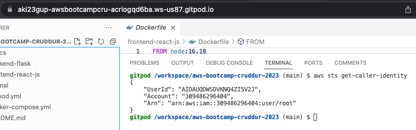
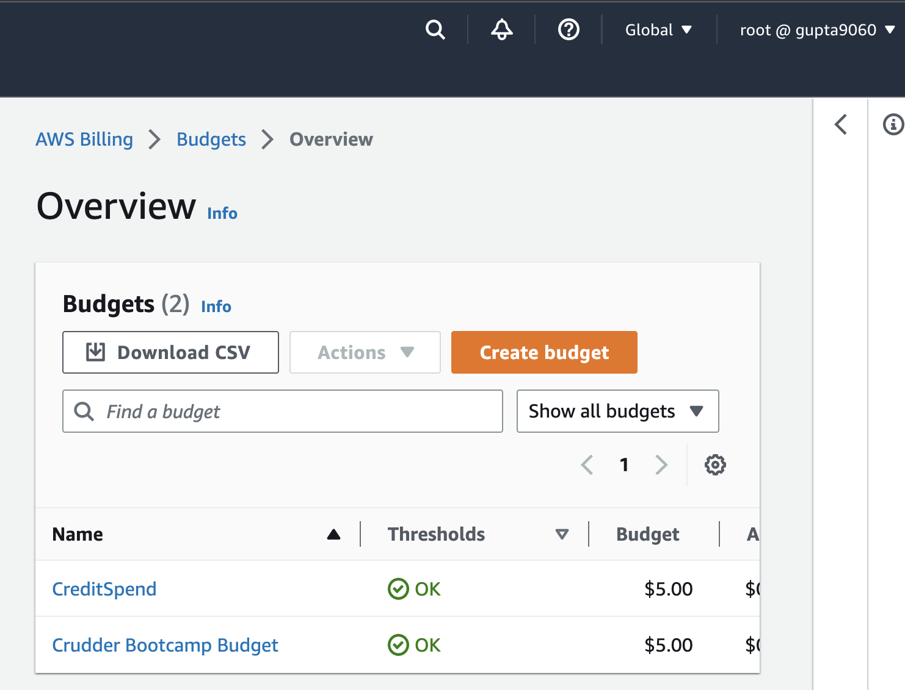
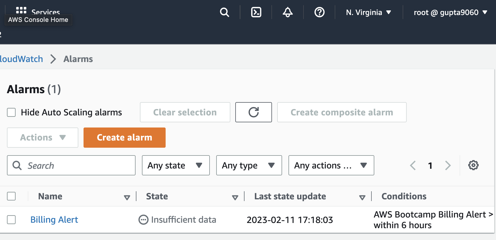
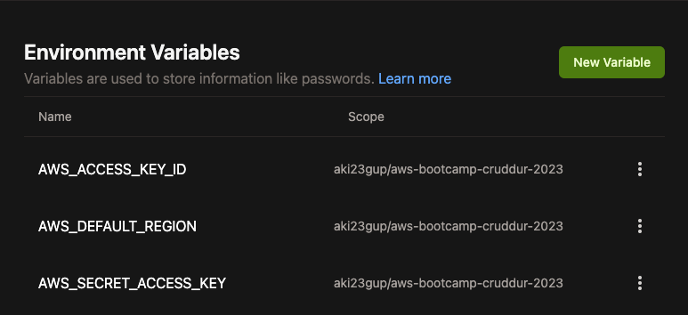

# Week 0 — Billing and Architecture

## Required Homework

### Creating a Conceptual Architectural Diagram

### Creating a Logical Architectural Diagram using LucidChart

### Installing AWS CLI
I installed AWS CLI on Gitpod using [Gitpod.yml Instructions](https://github.com/aki23gup/aws-bootcamp-cruddur-2023/blob/main/.gitpod.yml).

Here is proof of the working command **'aws get-caller-identity'** within Gitpod and its response:

### Creating a Billing Alarm using AWS Management Console
Following Chirag's weekly pricing considerations video, I was able to create a billing alarm 

### Creating a Budget via AWS CLI
I took upon the challenge of creating a budget of $5 USD via the CLI. I used the JSON [Templates](https://github.com/aki23gup/aws-bootcamp-cruddur-2023/tree/main/aws/json) to create a budget and a notification subscription. 

I also created another budget to watch and monitor my credit spend.

### Creating Environment Variables for AWS credentials in Gitpod
I created environment variables for my AWS credentials and added them to my Gitpod account.

### Other
In addition to the work mentioned above, I performed some other tasks as part of the required homework. These included:

- CloudShell: I played around with Cloudshell in order to get a gist of it's functionality. It's a pretty neat tool!
- Credentials: I generated AWS Credentials for my IAM admin account so they can be used by the CLI.

## Homework Challenges
