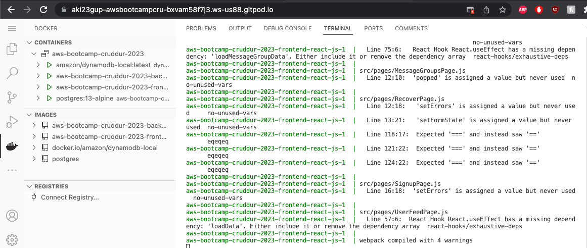
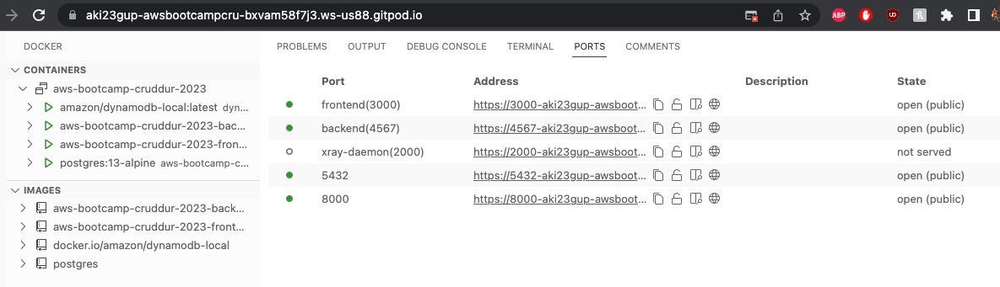
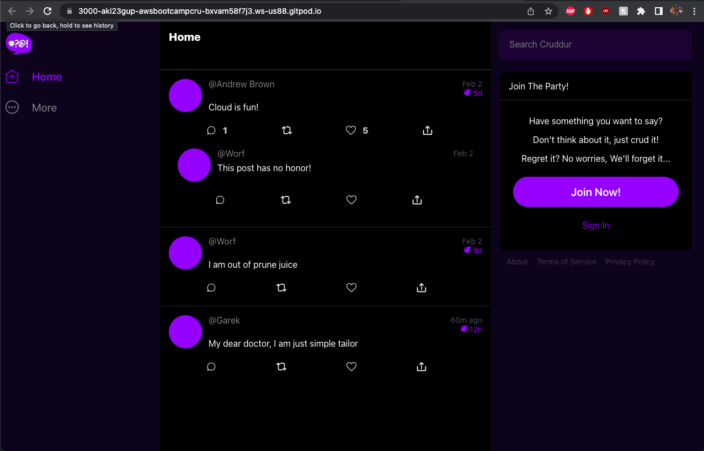
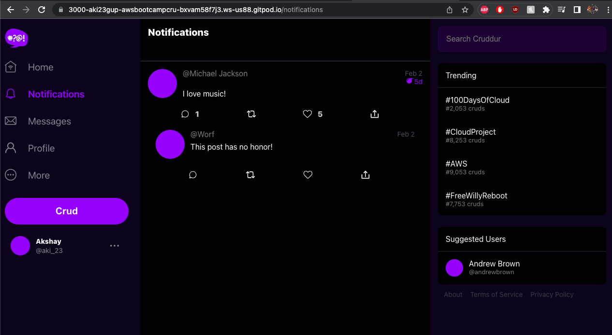
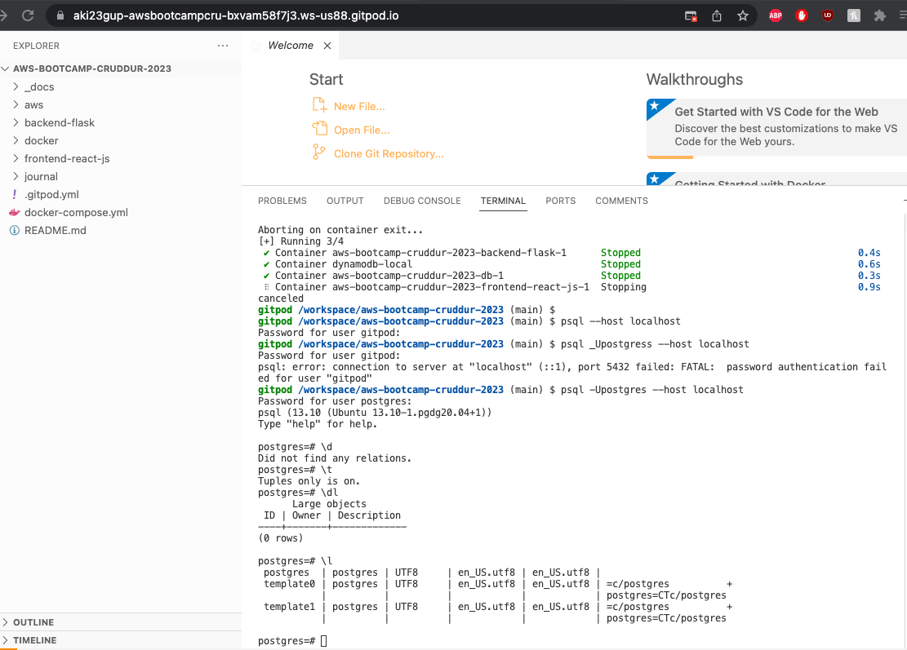

# Week 1 — App Containerization

## Required Homework

### Containerize Backend and Frontend applications separately with DockerFile

I created the Dockerfile's for both [Backend](https://github.com/aki23gup/aws-bootcamp-cruddur-2023/blob/main/backend-flask/Dockerfile) and [Frontend](https://github.com/aki23gup/aws-bootcamp-cruddur-2023/blob/main/frontend-react-js/Dockerfile) applications. Once created, the docker run/build commands succesfully launched the containers. 

### Orchestrate containerized Backend and Frontend applications together with Docker Compose

Since backend and frontend are seperate containers, we need a way to orchestrate between the two to have a functioning application. This is where Docker Compose steps in as it allows defining and running multi-container applications. 

Proof of Docker Compose building:

Proof of Ports coming up once containers are built:

Proof of frontend link test:

I created the [Docker-Compose](https://github.com/aki23gup/aws-bootcamp-cruddur-2023/blob/main/docker-compose.yml) file, where the URL of both the containers are defined for it to run appropriately. Now, the two containers are orchestrated and work in tandem once the 'Docker Compose Up' cli command is run in the Gitpod environment.

### Develop the Notification Endpoint feature 
#### Flask Endpoint for Notifications
Wrote the backend endpoint for the Notifications page by adding [this](https://github.com/aki23gup/aws-bootcamp-cruddur-2023/commit/e987cfcbe60bd3e66a95e5f64a34f925d4583cd9) to the app.py file

#### React Page for Notifications
Implemented frontend for the Notifications page by adding [this](https://github.com/aki23gup/aws-bootcamp-cruddur-2023/commit/f2c787b82ee490d25f5a631182180b84dd1c55ca) to the app.js file

Proof of notifications page:

### Creating DynamoDB and Postgres Containers

Added [this](https://github.com/aki23gup/aws-bootcamp-cruddur-2023/commit/8f00a9a451492f626a16e25ca374fce0d046c182) to the docker-compose and gitpod.yml files to install dynamodb and postgres in the containers. 

Left side of the screenshot shows the containers for DynamoDB and Postgres

Proof of Postgres functioning:

