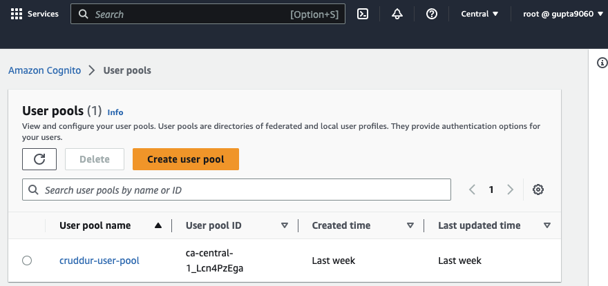
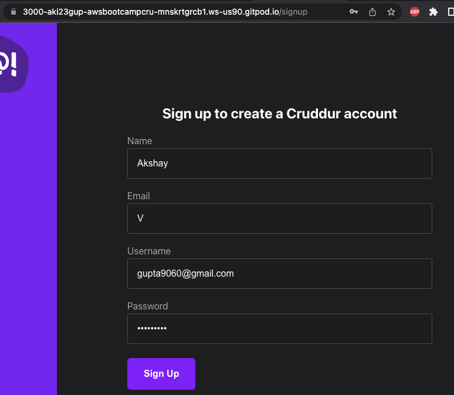
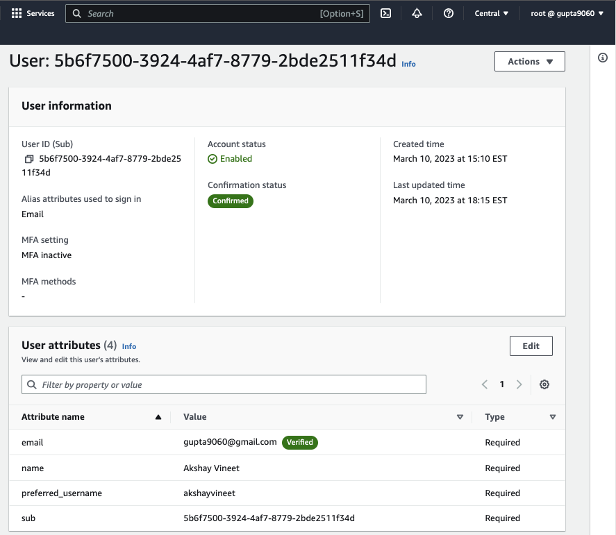
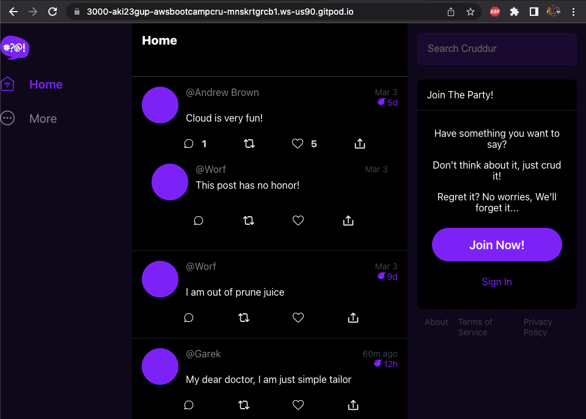
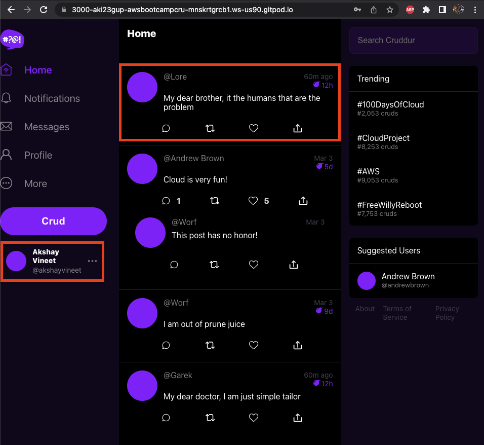

# Week 3 — Decentralized Authentication
This week focused on setting up decentralized authentication for users in our web application. Amazon Cognito is a service meantly exactly for this, as it enables user directory storage for easy signin/signup functionality. Furthermore, we focus on hooking up our Cognito User Pool to the app via AWS Amplify, and also implement JWT Tokens for secure transmission between components of the application. 

## Required Homework

### Setup AWS Cognito Pool
First, we create a User Pool via ClickOps. We will use Email as our sign-in option, as well as other parameters like preffered username and name for user profiles. 

### Implement Custom Signin/Signup Page
Following pool creation we can now build our [Signin/Signup Pages.](https://github.com/aki23gup/aws-bootcamp-cruddur-2023/commit/1afa926cac7712aa46396fabe90e164c31f611fb)

#### Signup Page

Once we Signup and create a user, we can verify if the user was created in our Cognito Pool:

### Implement Custom Recovery Page
A [Recovery Page](https://github.com/aki23gup/aws-bootcamp-cruddur-2023/commit/e358d006927a887ece20929f65244f11c8f7b6ae) is also needed incase user forgets their password. Cognito was chosen as an email provider for time being, as SES was not used due to its incurring costs. 

### Configure JWT Server-Side Tokens
[Backend Check](https://github.com/aki23gup/aws-bootcamp-cruddur-2023/commit/ef08a9d9349f1ba3f98effcb223a78b5f372db00)

[Fixes](https://github.com/aki23gup/aws-bootcamp-cruddur-2023/commit/03c5f3264168f6399b04e98abf59a5dc095f4891)

We created a sample Crud within the homefeed page to test JWT Token functionality:
Before Signup:

Here we can see that the crud is not showing up, as expected. 

Once logged in, the crud should show up, verifying JWT token functionality. 

