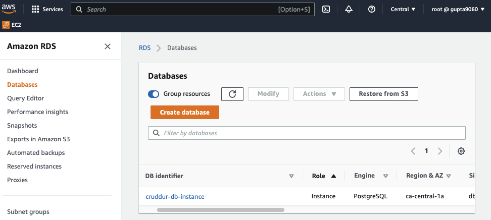
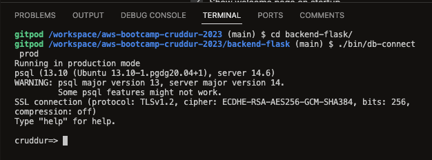
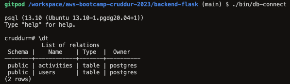
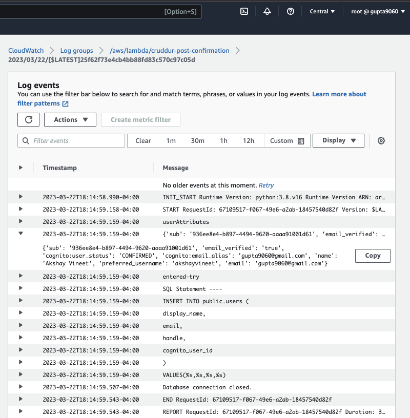
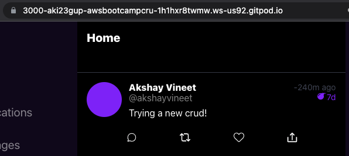
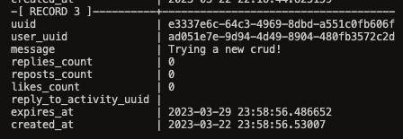

# Week 4 — Postgres and RDS
We know need to work towards data modelling in 3NF for SQL. This week focuses on implementing Postgres Relational Database into our backend application to store user and activity Crud post data. AWS RDS will be used as our Production Database. 
## Required Homework
### Provision an RDS instance
First, we provision an RDS instance via ClickOps. This will serve as our Prod Database. It uses a Postgres Engine and runs in the ca-central-1a availability zone. 

### Remotely connect to RDS instance
To connect to our prod database from our Gitpod Environment. We need to create a bash script named [db-connect](https://github.com/aki23gup/aws-bootcamp-cruddur-2023/blob/main/backend-flask/bin/db-connect). The script has a parameter that contains an if statement. If we enter the command ./bin/db-connect *prod*, this will connect to the prod database, if *prod* is left out of the command, then the script will connect to the local postgres database. 

### Programmatically update a security group rule
We also need to update the security group for our RDS DB to allow a connection from our Gitpod Environment. However, this becomes an issue as the IP Address of the environment does not persist after every reboot. [This](https://github.com/aki23gup/aws-bootcamp-cruddur-2023/commit/8c4f080720e3dda3d4d5d8f77f4f8f28c0dbf61c) was implemented to the gitpod.yml file to update the variable stored for the Gitpod Environment's IP, as well as running a script named [rds-update-sg-rule](https://github.com/aki23gup/aws-bootcamp-cruddur-2023/blob/8c4f080720e3dda3d4d5d8f77f4f8f28c0dbf61c/backend-flask/bin/rds-update-sg-rule), which will run a aws-cli command to update our RDS Security Group to reflect the new IP Address.
### Write several bash scripts for database operations

### Seed Postgres Database table with Data

### Create a schema SQL file by hand

### Implement a postgres client for python using a connection pool

### Implement a Lambda that runs in a VPC and commits code to RDS

### Creating Activity

### Issue: User Handle Appearance
[This](https://github.com/aki23gup/aws-bootcamp-cruddur-2023/commit/83c74ac356edb1ea0706f8e891a646503d6b20f1)
